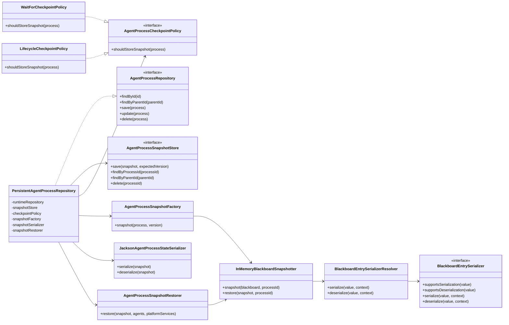

# Agent Process Persistence Support

This package contains framework support for checkpointing and restoring agent
processes. It is deliberately backend-neutral: durable storage is supplied
through `AgentProcessSnapshotStore`, while this package owns snapshot creation,
serialization, restoration, and decoration of an `InMemoryAgentProcessRepository`
or another runtime `AgentProcessRepository`.

The first supported lifecycle boundaries are:

- `WAITING`: used as a recovery checkpoint for HITL flows parked by `waitFor`.
- Finished states: used to advance durable state after resumed work completes,
  fails, is killed, or is terminated.

JDBC, cache, Redis, or other storage implementations are not shipped from this
package. They should implement `AgentProcessSnapshotStore` outside the framework
or appear as test fixtures.

## Extension Points

- Implement `AgentProcessSnapshotStore` for the application's durable backend.
- Implement `BlackboardEntrySerializer` for application values that should be
  stored as references, encrypted payloads, or stable DTOs instead of generic
  JSON object graphs.
- Choose `WaitForCheckpointPolicy` for recovery-only checkpoints or
  `LifecycleCheckpointPolicy` when the durable row should also reflect terminal
  process state.

`PersistentAgentProcessRepository` delegates first to an
`InMemoryAgentProcessRepository` in the current tests. More generally, that
delegate is the runtime repository holding active in-process objects; the
snapshot store is only consulted when the runtime repository misses.

## MUST TODO

- Add a JDBC `AgentProcessRepository` implementation for production cases that
  need runtime state and snapshots to participate in the same database
  transaction. The current tests use `InMemoryAgentProcessRepository` as the
  pluggable runtime repository.
- Add a configurable `BlackboardSnapshotter` SPI so persistence is not tied to
  `InMemoryBlackboard`.
- Add explicit action-boundary checkpoint support if durable state must advance
  after intermediate actions, not only at `WAITING` and terminal boundaries.
- Review direct `AgentProcessSnapshotStore` versioning ergonomics. The
  persistent repository computes expected versions, but direct store callers must
  still supply the correct compare-and-set version.
- Define retry or outbox semantics for rejected checkpoints in multi-runtime
  deployments.
- Decide whether repeated `InMemoryBlackboard.bind` calls for the same key
  should keep historical entry values or replace the earlier entry. Snapshot
  restore preserves the current behavior, which can make overwritten values
  visible as unnamed entries.

## Scope

Most classes in this package are `internal` because they are support
implementation rather than public API. Public customization is intentionally
limited to the storage SPI, checkpoint policy, and blackboard entry serializers.
