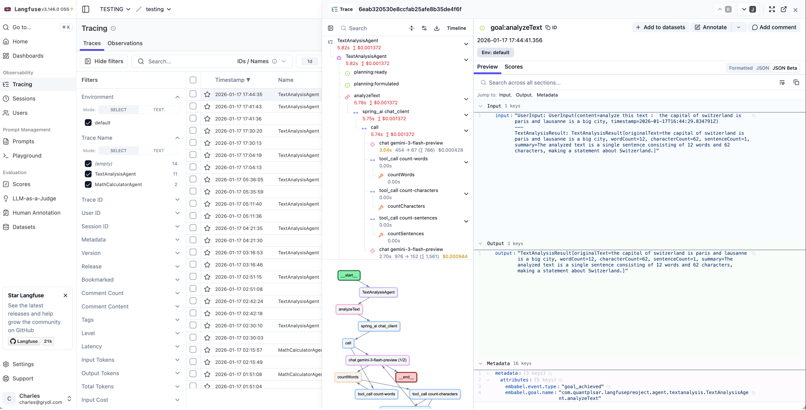
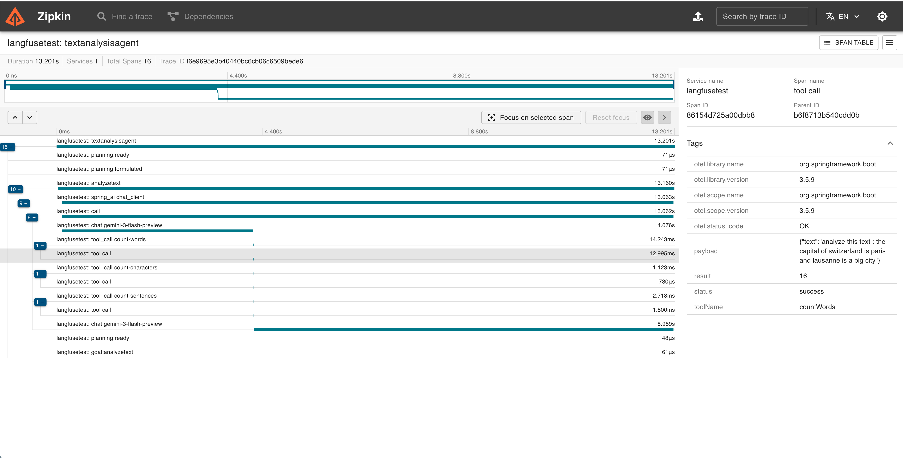

# Embabel Agent Observability

[](https://openjdk.org/projects/jdk/21/)
[](https://spring.io/projects/spring-boot)
[](https://opentelemetry.io/)
[](LICENSE)

**Unified observability for Embabel AI Agents** — Automatic tracing, metrics, and LLM call integration with zero code changes.

---

## See It In Action

### Langfuse



### Zipkin



---

## Quick Start

> **Note:** This library is published to the Embabel snapshot repository. Add the following repository to your `pom.xml`:
> ```xml
> <repositories>
>     <repository>
>         <id>embabel-snapshots</id>
>         <url>https://repo.embabel.com/snapshots</url>
>         <snapshots>
>             <enabled>true</enabled>
>         </snapshots>
>     </repository>
> </repositories>
> ```

### 1. Add the core dependency

```xml
<dependency>
    <groupId>com.embabel.agent</groupId>
    <artifactId>embabel-agent-starter-observability</artifactId>
    <version>${embabel-agent.version}</version>
</dependency>
```

### 2. Add common configuration

```yaml
# Embabel Observability
embabel:
  observability:
    enabled: true
    service-name: my-agent-app
    max-attribute-length: 4000

# Spring Boot Tracing (required)
management:
  tracing:
    enabled: true
    sampling:
      probability: 1.0  # 1.0 = 100%, 0.5 = 50%, etc.
```

### 3. Choose your exporter

<details>
<summary><b>Option A: Langfuse</b> (LLM-focused observability)</summary>

```xml
<dependency>
    <groupId>com.quantpulsar</groupId>
    <artifactId>opentelemetry-exporter-langfuse</artifactId>
    <version>0.4.0</version>
</dependency>
```

**For Langfuse Cloud:**
```yaml
management:
  langfuse:
    enabled: true
    endpoint: https://cloud.langfuse.com/api/public/otel
    public-key: pk-lf-...
    secret-key: sk-lf-...
```

**For local Langfuse instance (self-hosted):**
```yaml
management:
  langfuse:
    enabled: true
    endpoint: http://localhost:3000/api/public/otel
    public-key: pk-lf-your-public-key
    secret-key: sk-lf-your-secret-key
```

</details>

<details>
<summary><b>Option B: Zipkin</b> (Distributed tracing)</summary>

```xml
<dependency>
    <groupId>io.opentelemetry</groupId>
    <artifactId>opentelemetry-exporter-zipkin</artifactId>
</dependency>
```

```yaml
management:
  zipkin:
    tracing:
      endpoint: http://localhost:9411/api/v2/spans
```

Run Zipkin locally:
```bash
docker run -d -p 9411:9411 openzipkin/zipkin
```

</details>

<details>
<summary><b>Option C: Prometheus + Grafana</b> (Metrics & dashboards)</summary>

```xml
<dependency>
    <groupId>io.micrometer</groupId>
    <artifactId>micrometer-registry-prometheus</artifactId>
</dependency>
```

```yaml
management:
  endpoints:
    web:
      exposure:
        include: prometheus, health, metrics
  prometheus:
    metrics:
      export:
        enabled: true
```

Metrics available at: `http://localhost:8080/actuator/prometheus`

Run Prometheus + Grafana locally:
```bash
docker run -d -p 9090:9090 prom/prometheus
docker run -d -p 3000:3000 grafana/grafana
```

</details>

<details>
<summary><b>Option D: OTLP</b> (Jaeger, Grafana Tempo, etc.)</summary>

```xml
<dependency>
    <groupId>io.opentelemetry</groupId>
    <artifactId>opentelemetry-exporter-otlp</artifactId>
</dependency>
```

```yaml
management:
  otlp:
    tracing:
      endpoint: http://localhost:4317
```

</details>

### 4. Done!

Your agents are now fully traced. No code changes required.

---

## Features

### Implemented

| Feature | Description |
|---------|-------------|
| **Agent Lifecycle Tracing** | Full trace of agent creation, execution, completion, failures, and process kill, with the turn `input.value`/`output.value` |
| **Sub-agent Hierarchy** | Proper parent-child span relationships for sub-agents |
| **Action Tracing** | Each action execution as a child span with duration, status, and `input.value`/`output.value` |
| **LLM Call Spans** | A span per LLM interaction (`embabel.llm`) with model, operation, agent and action; plus an `embabel.llm.invocation` span per model round-trip carrying token usage and cost |
| **Embedding Spans** | An `embabel.embedding` span per embedding invocation with model and token usage/cost |
| **Tool Loop Tracing** | An `embabel.tool_loop` span wrapping the tool loop (with the prompt `input.value` and result `output.value`), plus an `embabel.tool_loop.completed` point span with iteration count and replan flag |
| **Input / Output Capture** | Agent, action and tool-loop spans carry `input.value`/`output.value` (OpenInference keys, rendered in Langfuse's input/output panels), truncated to `max-attribute-length` |
| **Tool Call Tracing** | Every tool invocation as an `embabel.tool` span with tool name, group, correlation id, status, duration, arguments/result and error (Spring AI's native `tool call` span is suppressed in favour of this richer one) |
| **Goal & Replan Tracing** | `embabel.goal` on goal achievement (name + result) and `embabel.replan` on replan requests (reason) |
| **LLM Call Integration** | Spring AI ChatModel calls automatically appear as child spans via `ChatModelObservationFilter` |
| **LLM Token Metrics & Cost** | `gen_ai.usage.*` tokens and `embabel.llm.cost` on per-invocation spans, plus business-metric counters |
| **Planning Events** | Track plan formulation, replanning iterations, and replan requests with reasons |
| **RAG Pipeline Tracing** | Full RAG event tracing: request, response, pipeline stages, and enhancement steps |
| **Ranking Events** | Agent routing decisions: ranking requests, choices made (with score), and failures (with confidence cutoff) |
| **Dynamic Agent Creation Tracing** | Platform events for dynamically created agents |
| **State Transitions** | Monitor workflow state changes |
| **Lifecycle States** | Visibility into WAITING, PAUSED, STUCK states |
| **Multi-Exporter Support** | Send traces to multiple backends simultaneously |
| **Automatic Metrics** | Duration and count metrics (Spring Observation mode) |
| **Business Metrics** | Micrometer counters/gauges: active agents, LLM tokens, cost, errors, replanning |
| **OpenTelemetry GenAI Semantic Conventions** | Consistent `gen_ai.*` attributes across all spans (`gen_ai.operation.name`, `gen_ai.request.model`, `gen_ai.tool.name`, etc.) |
| **ChatModel Observation Filter** | Enriches Spring AI observations with prompts, completions, token counts, and model info |
| **`@Tracked` Annotation** | Custom operation tracking with automatic span creation |
| **MDC Log Correlation** | Automatic SLF4J MDC propagation of agent context (run ID, agent name, action name) |

### Coming Soon

| Feature | Target |
|---------|--------|
| Pre-built Grafana Dashboards | v1.0.x |

---

## Supported Backends

| Backend | Type | Module |
|---------|------|--------|
| **Langfuse** | Traces | [`opentelemetry-exporter-langfuse`](https://github.com/quantpulsar/opentelemetry-exporter-langfuse) |
| **Zipkin** | Traces | [`opentelemetry-exporter-zipkin`](https://github.com/open-telemetry/opentelemetry-java) |
| **OTLP** (Jaeger, Tempo) | Traces | [`opentelemetry-exporter-otlp`](https://github.com/open-telemetry/opentelemetry-java) |
| **Prometheus** | Metrics | [`micrometer-registry-prometheus`](https://github.com/micrometer-metrics/micrometer) |
| **Custom** | Traces | Implement `SpanExporter` |

> **Tip:** You can use multiple exporters simultaneously (e.g., Langfuse for traces + Prometheus for metrics).

---

## Configuration

| Property | Default | Description |
|----------|---------|-------------|
| `embabel.observability.enabled` | `true` | Master switch for the whole module (traces **and** metrics) |
| `embabel.observability.tracing-enabled` | `true` | **Umbrella switch for tracing (spans).** When `false`, no spans are produced regardless of the per-tier `trace-*` switches below. Independent of `metrics-enabled` |
| `embabel.observability.metrics-enabled` | `true` | Enable/disable Micrometer business metrics (independent of tracing) |
| `embabel.observability.service-name` | `embabel-agent` | Service name in traces |
| `embabel.observability.trace-agent-events` | `true` | Register the agent/action/tool-loop/LLM span conventions |
| `embabel.observability.trace-tool-calls` | `true` | Trace tool invocations (`embabel.tool` span) |
| `embabel.observability.trace-tool-loop` | `true` | Trace tool loop execution (`embabel.tool_loop` + `embabel.tool_loop.completed` spans) |
| `embabel.observability.trace-llm-calls` | `true` | Trace LLM invocations (`embabel.llm.invocation` span: model, tokens, cost) |
| `embabel.observability.trace-embedding` | `true` | Trace embedding invocations (`embabel.embedding` span: model, tokens, cost) |
| `embabel.observability.trace-planning` | `true` | Trace plan formulation (`embabel.planning`) and replan requests (`embabel.replan`) |
| `embabel.observability.trace-state-transitions` | `true` | Trace state transitions (`embabel.state_transition` span) |
| `embabel.observability.trace-lifecycle-states` | `true` | Trace lifecycle states — COMPLETED/FAILED/WAITING/PAUSED/STUCK (`embabel.lifecycle`) and goal achievement (`embabel.goal`) |
| `embabel.observability.trace-rag` | `true` | Trace RAG responses (`embabel.rag` span) |
| `embabel.observability.trace-ranking` | `true` | Trace ranking/selection events — agent routing (`embabel.ranking` span) |
| `embabel.observability.trace-dynamic-agent-creation` | `true` | Trace dynamic agent creation (`embabel.dynamic_agent_creation` span) |
| `embabel.observability.trace-http-details` | `true` | Trace HTTP request/response details (bodies, headers) |
| `embabel.observability.trace-tracked-operations` | `true` | Enable/disable `@Tracked` annotation aspect |
| `embabel.observability.mdc-propagation` | `true` | Propagate agent context into SLF4J MDC for log correlation |
| `embabel.observability.max-attribute-length` | `4000` | Max attribute length before truncation |

### Tool and tool-loop spans

Tool calls are traced by the `embabel.tool` span (rich: name, group, correlation id, status,
duration, arguments/result, error) emitted by this module's event listener, gated by
`trace-tool-calls`. Spring AI's thinner native `tool call` observation is therefore **always
suppressed** to avoid a duplicate — by an `ObservationPredicate` registered in this module.

The `embabel.tool_loop` span is opened directly at the work site in the agent core (so its hierarchy
is always correct, even under parallelism). The core never reads the `trace-*` flags — that would
couple it to this module. Instead, `trace-tool-loop=false` makes the same predicate drop the
`embabel.tool_loop` span by name; a suppressed span becomes a no-op, so its children simply re-parent
to the next live ancestor span.

```yaml
embabel:
  observability:
    trace-tool-calls: false   # drop the 'embabel.tool' spans
    trace-tool-loop: false    # drop the 'embabel.tool_loop' spans
```

---

## How It Works

Tracing uses **direct Micrometer instrumentation**: the long-scoped spans (agent turn, action,
LLM call, tool loop) are opened and closed with `observe{}` right at the work site in the agent
core, on the thread doing the work. This makes the span hierarchy correct *by construction* —
including heavy parallelism (PARALLEL mode, sub-agents, async user code) — because nesting comes from
Micrometer's current-observation mechanism and cross-thread context propagation, not from
reconstructing relationships out of a decoupled event stream.

Short-lived **point events** (LLM/embedding invocations, tool calls, planning, replan, tool-loop
completion, RAG, ranking, state transitions, lifecycle, goal, dynamic agent creation) hold no scope,
so they are emitted as instantaneous spans by a small event-driven listener
(`EmbabelSpanEventListener`), nested under the current observation.

```
┌──────────────────────────────────────────────────────────────┐
│                       EMBABEL AGENT CORE                       │
│   observe{} at the work site (thin context + span name only)   │
│   embabel.agent → embabel.action → embabel.llm                 │
│                 → embabel.tool_loop                            │
└───────────────┬────────────────────────────────┬──────────────┘
                │ (long-scoped spans)             │ (events)
                │                                 ▼
                │                   ┌─────────────────────────────┐
                │                   │  EmbabelSpanEventListener    │  point spans:
                │                   │  (this module)               │  embabel.llm.invocation,
                │                   └──────────────┬──────────────┘  embabel.embedding, embabel.tool,
                │                                  │                 planning/replan/rag/ranking/
                ▼                                  ▼                 state/lifecycle/goal/dynamic
        ┌───────────────────────────────────────────────────┐
        │            ObservationRegistry                     │
        │  + Embabel span conventions (attributes)           │
        │  + tier-filter ObservationPredicate (trace-* off)  │
        └───────────────────┬───────────────────────────────┘
                            │
            ┌───────────────┴────────────────┐
            ▼                                ▼
  ┌──────────────────────┐        ┌────────────────────────┐
  │ DefaultTracing       │        │ EmbabelMetricsEvent     │  (event-driven,
  │ ObservationHandler   │        │ Listener → MeterRegistry │   independent of tracing)
  │ → OpenTelemetry      │        └────────────────────────┘
  └─────────┬────────────┘
            │
   ┌────────┼──────────┬──────────┐
   ▼        ▼          ▼          ▼
┌────────┐┌────────┐┌────────┐┌────────┐
│Langfuse││ Zipkin ││  OTLP  ││ Custom │
└────────┘└────────┘└────────┘└────────┘
```

**Key Points:**
- Long-scoped spans are instrumented directly in the core; the **standard** Micrometer
  `DefaultTracingObservationHandler` turns them into OpenTelemetry spans (no custom handler).
- Span attributes live in this module as `GlobalObservationConvention`s; the core carries only thin
  context wrappers + span names, so it has **no dependency on this module** and runs without it.
- Point events become instantaneous child spans via `EmbabelSpanEventListener`.
- Correct parent-child hierarchy even under parallelism, via context propagation — no event-stream
  reconstruction, no held scopes between events.
- Business metrics are event-driven and **independent** of tracing (`metrics-enabled`).
- Zero code instrumentation required; multiple exporters can run simultaneously.
- OpenTelemetry GenAI semantic conventions (`gen_ai.*`) for interoperability with LLM observability platforms.

---

## Trace Hierarchy Example

Every span carries two names: the **contextual** name is the human-friendly label shown in the trace
backend (kebab-cased by the standard handler), and the low-cardinality **meter** name (`embabel.*`,
shown in parentheses below) is the stable identifier used for metrics. Below, the label is the
contextual name and the parenthesised value is the meter name.

```
customer-service-agent                 (embabel.agent — one run() turn)
├── planning                           (embabel.planning) [goal=RequestProcessed, action_count=3]
├── analyze-request                    (embabel.action)
│   └── gpt-4o                         (embabel.llm — one LLM interaction)
│       └── tool-loop                  (embabel.tool_loop)
│           ├── gpt-4o                 (embabel.llm.invocation) [usage.input_tokens=…, output_tokens=…, cost=…]
│           ├── search-knowledge-base  (embabel.tool) [status=success]
│           └── tool-loop-completed    (embabel.tool_loop.completed) [total_iterations=2, replan_requested=false]
├── generate-response                  (embabel.action)
│   └── gpt-4o                         (embabel.llm)
│       └── tool-loop                  (embabel.tool_loop)
│           └── gpt-4o                 (embabel.llm.invocation)
├── request-processed                  (embabel.goal)
└── completed                          (embabel.lifecycle)
```

> `embabel.ranking` (agent routing) is a platform-level decision with no enclosing agent process, so
> it is emitted as its own root span rather than nested in a turn.

### Input / Output

The `embabel.agent`, `embabel.action` and `embabel.tool_loop` spans carry the step's input and output
under the **OpenInference** keys `input.value` and `output.value` — which LLM-observability backends
(Langfuse, etc.) render in their dedicated input/output panels:

- **agent** — input: the bound `UserInput`(s); output: the run's last result.
- **action** — input: the action's declared inputs read from the blackboard; output: the action's result.
- **tool_loop** — input: the prompt messages; output: the loop result.

Both are truncated to `embabel.observability.max-attribute-length`. These keys are vendor-neutral
(OpenInference), not Langfuse-specific.

### Sub-agent Hierarchy

A sub-agent runs its own `run()` turn, so its `embabel.agent` span nests under the parent action that
spawned it (cross-thread parent propagation handles async spawning):

```
orchestrator-agent                     (embabel.agent — root turn)
├── delegate-to-specialist             (embabel.action)
│   └── specialist-agent               (embabel.agent — sub-agent turn)
│       ├── specialized-task           (embabel.action)
│       │   └── claude-3-5-sonnet      (embabel.llm)
│       └── embabel.lifecycle          [state=COMPLETED]
└── embabel.lifecycle                  [state=COMPLETED]
```

---

## Custom Operation Tracking with `@Tracked`

For tracking custom operations in your agent code, use the `@Tracked` annotation. It automatically creates observability spans capturing inputs, outputs, duration, and errors.

### Basic Usage

```java
@Tracked("enrichCustomer")
public Customer enrich(Customer input) {
    // Your logic here
}
```

### With Type and Description

```java
@Tracked(value = "callPaymentApi", type = TrackType.EXTERNAL_CALL, description = "Payment gateway call")
public PaymentResult processPayment(Order order) {
    // ...
}
```

### Available Track Types

| Type | Description |
|------|-------------|
| `CUSTOM` | General-purpose (default) |
| `PROCESSING` | Data processing operation |
| `VALIDATION` | Validation or verification step |
| `TRANSFORMATION` | Data transformation |
| `EXTERNAL_CALL` | External service/API call |
| `COMPUTATION` | Computation or calculation |

### What Gets Captured

- **Operation name** (from `value` or method name)
- **Method arguments with parameter names** (e.g., `{query=hello, limit=10}`, truncated to `max-attribute-length`)
- **Return value** (truncated to 256 chars)
- **Duration** (automatic)
- **Errors** (automatic, with stack trace)
- **Agent context** (runId, agent name — when inside an agent process)

> **Note:** Parameter names are automatically resolved via the method signature. If parameter names are not available (e.g., compiled without `-parameters` flag and no debug info), the output falls back to array format: `[hello, 10]`.

### Trace Hierarchy

When `@Tracked` methods are called within an agent execution, spans are automatically nested under the current action or agent span:

```
customer-service-agent              (embabel.agent)
├── process-order                   (embabel.action)
│   ├── enrich-customer             (@Tracked, PROCESSING)
│   ├── gpt-4o                      (embabel.llm)
│   └── call-payment-api            (@Tracked, EXTERNAL_CALL)
└── completed                       (embabel.lifecycle)
```

### Important: Spring AOP Proxy Limitation

`@Tracked` uses Spring AOP, which is proxy-based. This means **internal method calls within the same class are not intercepted**:

```java
@Component
public class MyService {

    @Tracked("step1")
    public String step1() { return "ok"; }

    public void process() {
        step1(); // this.step1() — bypasses the proxy, @Tracked NOT triggered!
    }
}
```

**Workarounds** (from simplest to most complete):

**1. Extract to a separate bean (recommended):**
```java
@Component
public class MyService {
    private final MyTrackedOps ops; // injected by Spring

    public void process() {
        ops.step1(); // goes through the proxy — @Tracked works!
    }
}

@Component
public class MyTrackedOps {
    @Tracked("step1")
    public String step1() { return "ok"; }
}
```

**2. Self-injection:**
```java
@Component
public class MyService {
    @Autowired
    private MyService self; // Spring injects the proxy, not this

    public void process() {
        self.step1(); // goes through the proxy — @Tracked works!
    }

    @Tracked("step1")
    public String step1() { return "ok"; }
}
```

---

## MDC Propagation for Log Correlation

Embabel Agent context is automatically propagated into SLF4J MDC, making it easy to filter and correlate application logs by agent run or action.

### MDC Keys

| MDC Key | Description | Set on | Removed on |
|---------|-------------|--------|------------|
| `embabel.agent.run_id` | Agent process ID | Agent creation | Agent completed/failed/killed |
| `embabel.agent.name` | Agent name | Agent creation | Agent completed/failed/killed |
| `embabel.action.name` | Current action name | Action start | Action result |

### Logback Pattern Example

```xml
<pattern>%d{HH:mm:ss.SSS} [%thread] %-5level %logger{36} [runId=%X{embabel.agent.run_id} agent=%X{embabel.agent.name} action=%X{embabel.action.name}] - %msg%n</pattern>
```

This produces logs like:
```
14:23:45.123 [main] INFO  c.e.MyService [runId=abc-123 agent=CustomerServiceAgent action=AnalyzeRequest] - Processing request
```

To disable MDC propagation:
```yaml
embabel:
  observability:
    mdc-propagation: false
```

---

## Business Metrics (Micrometer)

When a `MeterRegistry` is available (e.g. via `micrometer-registry-prometheus`), the module automatically registers the following business metrics, independent of the tracing implementation chosen:

| Metric | Type | Tags | Description |
|--------|------|------|-------------|
| `embabel.agent.active` | Gauge | — | Number of agent processes currently running |
| `embabel.agent.duration` | Timer | `agent`, `status` | Agent process duration (completed/failed) |
| `embabel.agent.errors.total` | Counter | `agent` | Total agent process failures |
| `embabel.agent.stuck.total` | Counter | `agent` | Agent stuck events (unable to plan) |
| `embabel.llm.requests.total` | Counter | `agent`, `model` | Total LLM requests |
| `embabel.llm.duration` | Timer | `model`, `agent` | LLM call duration |
| `embabel.llm.tokens.total` | Counter | `agent`, `direction` (input/output) | LLM tokens consumed |
| `embabel.llm.cost.total` | Counter | `agent` | Estimated LLM cost in USD |
| `embabel.tool.calls.total` | Counter | `tool`, `agent` | Total tool calls |
| `embabel.tool.duration` | Timer | `tool`, `agent` | Tool call duration |
| `embabel.tool.errors.total` | Counter | `tool`, `agent` | Tool call failures |
| `embabel.tool_loop.iterations` | Summary | `agent` | Tool loop iteration counts |
| `embabel.planning.replanning.total` | Counter | `agent` | Replanning events |

These metrics are exploitable by **Prometheus** and **Grafana** out of the box. To disable:

```yaml
embabel:
  observability:
    metrics-enabled: false
```

---

## Roadmap

| Phase | Version | Features |
|-------|---------|----------|
| **Current** | v0.3.x | Agent, Action, Tool, LLM, Tool Loop, Planning, State, RAG, Ranking, Dynamic Agent Creation tracing. Business metrics, MDC propagation, `@Tracked` annotation, ChatModel filter, GenAI semantic conventions. |
| **Long Term** | v1.0.x | Pre-built Grafana dashboards, alerting, cost analytics |

---

## Requirements

- Java 21+
- Spring Boot 3.5+
- Embabel Agent 0.3.3+

---

## License

Apache License 2.0 - See [LICENSE](LICENSE) for details.

---

## Contributing

Contributions are welcome! You can help by:
- Reporting bugs or suggesting features
- Submitting pull requests
- Adding or improving tests

---
